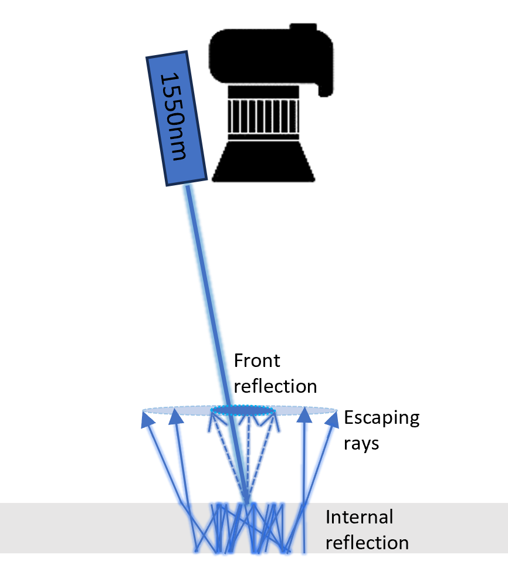
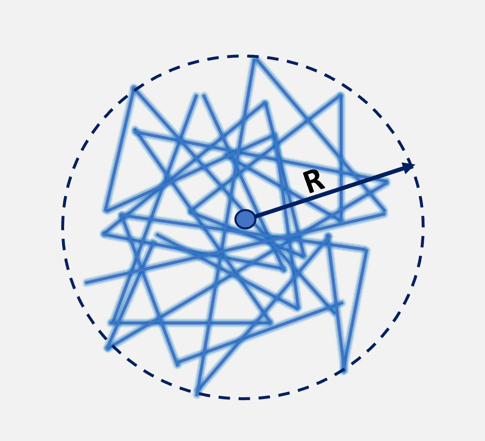

# Light-Trapping-Project
This repo contains the code for my senior research project "_A Parameterization Method for Light Trapping in Silicon Solar Cells_", conducted under the supervision of Dr. Kleiman from Engineering Physics department.

The project focused on analyzing the escape light patterns of a 1550 nm laser during the internal reflection process in silicon solar cells. This analysis was conducted using Python and involved an InGaAs-based camera to capture the light patterns.

This schematic drawing shows when the laser hit a solar cell, first reflection will happen on the front surface of the cell. Part of the laser will get deflected into the solar. Through a series of internal reflection, it will eventually escapen the cell, since 1550 nm wavelength has negligible absorption coefficient in silicon.  

[ReadImage.py](ReadImage.py): This script retrieves the pixel values from the image, finds the centroid of the image (the brightest spot), and makes a histogram of intensity (pixel values) vs. radius.

[Simulation.py](Simulation.py): This script simulates light trapping in an ideal silicon solar cell for many iterations.

