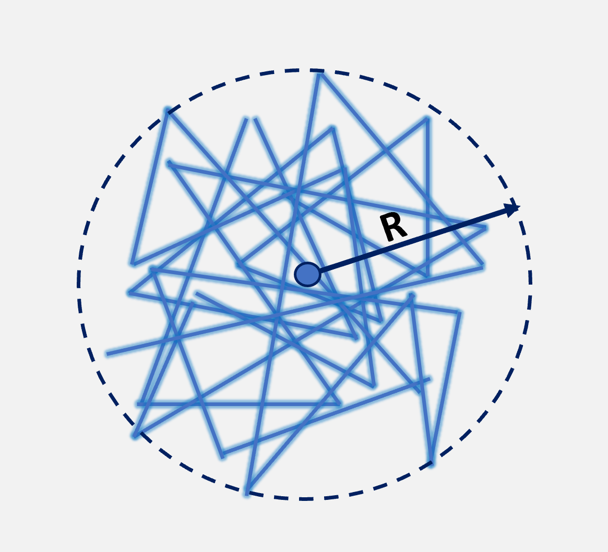
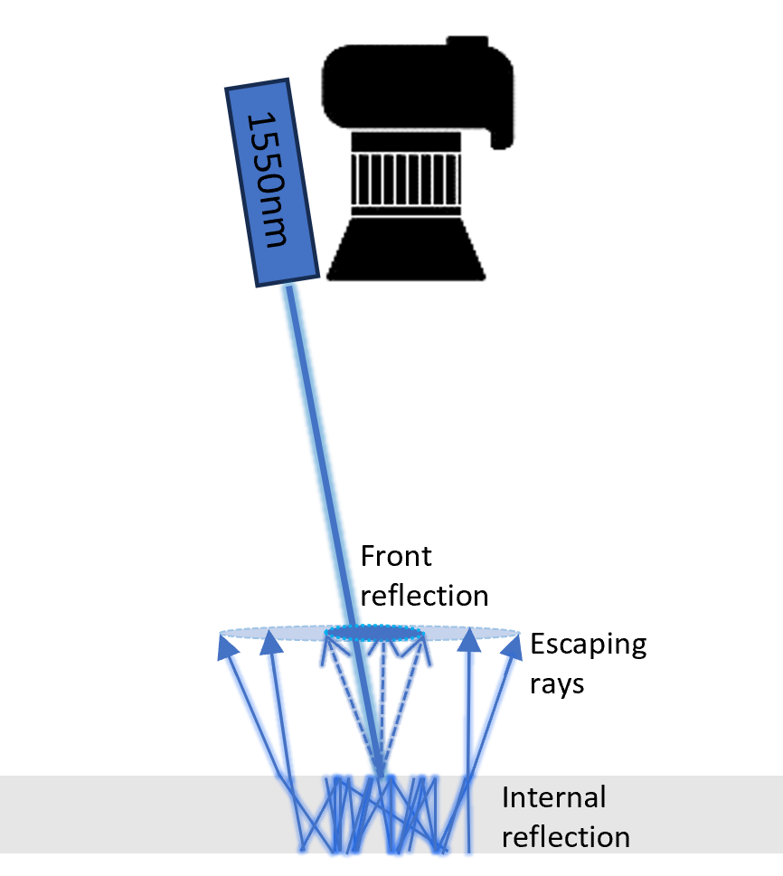

# *A Parameterization Method for Light Trapping in Silicon Solar Cells*

This is a senior (final-year) research project completed at McMaster University under the supervision of Dr. Kleiman in the Department of Engineering Physics.

## Overview

This project investigated the spatial patterns of light escaping from silicon solar cells illuminated by a **1550 nm laser**. An **InGaAs camera** captured the light patterns, which were analyzed using Python.

## Experimental Principle

When the laser struck the solar cell, some light reflected from its front surface while the remainder entered the silicon through refraction. The light then underwent a series of internal reflections before eventually escaping the cell.

Silicon has a low absorption coefficient at 1550 nm, allowing the escaping light patterns to be observed and analyzed.

  
  &nbsp;&nbsp;&nbsp;&nbsp;&nbsp;&nbsp;
  
   
  <em>Schematics illustrating light propagation and internal reflection in a silicon solar cell.</em>

## Code

| Script | Description |
| --- | --- |
| [ReadImage.py](ReadImage.py) | Extracts pixel intensities from a captured image, calculates the centroid of the light pattern, and generates a radial intensity histogram. |
| [Simulation.py](Simulation.py) | Simulates light trapping and internal reflection in an ideal silicon solar cell over multiple iterations. |

## Tools and Technologies

- Python
- Abaqus
- InGaAs camera
- 1550 nm laser
